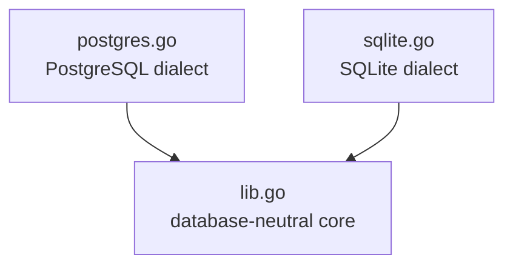
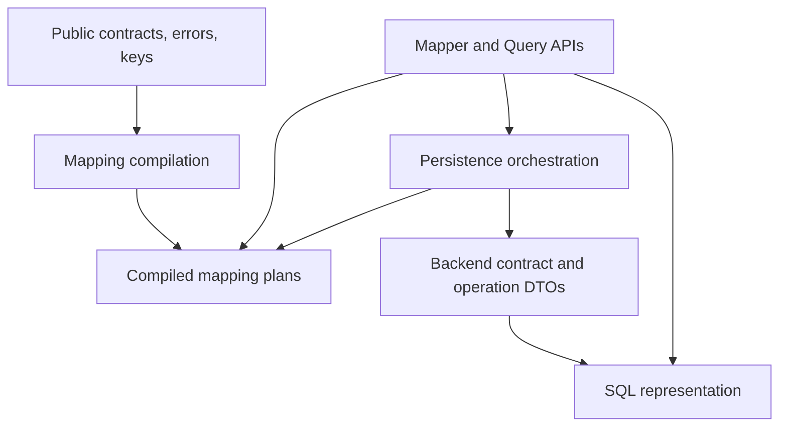

# agg — Source Dependency Analysis

The production distribution is intentionally optimized for copy vendoring. The
database-neutral implementation is one canonical file, while concrete SQL
rendering and execution remain selectable backend files.

## Distribution Units

| Use case | Files |
|---|---|
| PostgreSQL | `lib.go` + `postgres.go` |
| SQLite | `lib.go` + `sqlite.go` |
| Repository development and tests | all three files |

`lib.go` compiles without referring to either concrete backend. Each backend
declares its own public dialect value, so omitting the other backend does not
leave an unresolved symbol.

## `lib.go` Layering

The file follows public-to-private call flow:

Go declarations are order-independent, so the physical order favors a reader
following the public API into its implementation. Within each section, public
entry types come first, methods stay adjacent to their receiver type, and private
helpers follow execution order.

## Boundary Checks

| Check | Status |
|---|---|
| Core has no external module dependency | OK |
| Core does not reference a concrete backend type or value | OK |
| Each backend owns its public dialect value | OK |
| Mapper validates inputs and delegates graph operations | OK |
| Persistence does not depend on Mapper | OK |
| Backend operation DTOs contain no child relation metadata | OK |
| Dialects render planned operations without reclassifying entity intent | OK |
| Tests remain split by unit, contract, and concrete database | OK |

## Intentional Backend Size

`postgres.go` and `sqlite.go` keep rendering and execution together. They should
only be split if backend-specific maintenance or testing demonstrates a concrete
need; file length alone is not a reason to weaken the copy-vendoring layout.
