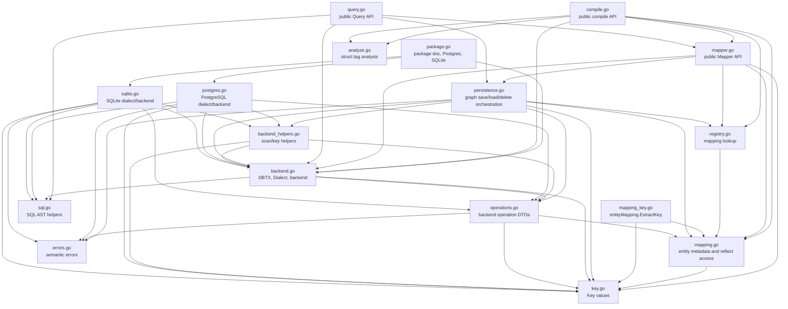

# ormapper — File Dependency Analysis

This report tracks the intended source-file layering after the persistence
semantic refactor. The important check is that backend contracts no longer point
at concrete database engines.

## Layered View

## Boundary Checks

| Check | Status | Notes |
|---|---|---|
| `backend.go` does not depend on `postgres.go` or `sqlite.go` | OK | `backend.go` owns only contracts. |
| Built-in dialect exposure is centralized | OK | `package.go` exposes `Postgres` and `SQLite`. |
| Concrete backend construction lives with each engine | OK | `postgresDialect.newBackend` is in `postgres.go`; `sqliteDialect.newBackend` is in `sqlite.go`. |
| `Mapper` does not perform graph persistence itself | OK | `mapper.go` validates public API inputs and delegates to `persistence.go`. |
| `persistence.go` no longer depends on `Mapper` | OK | It receives `mappingRegistry` and `backend`. |
| `save_graph.go` cross-reference is gone | OK | Relation snapshot/reconcile code is merged into `persistence.go`. |
| `extract.go` standalone file is gone | OK | Key extraction is now `mapping_key.go`, adjacent to mapping metadata. |
| `mapping.go` no longer depends on persistence helpers | OK | `uniqueFieldNames` moved into mapping code. |

## Current File Roles

| File | Role |
|---|---|
| `package.go` | Package documentation and built-in dialect entry points. |
| `backend.go` | Public DB handle abstraction plus internal backend contract. |
| `compile.go` | Public mapping registration plus private mapping construction subroutines. |
| `analyze.go` | Struct field and tag analysis. |
| `registry.go` | Mapping lookup abstraction shared by Mapper and persistence. |
| `mapper.go` | Public aggregate API: `Get`, `Save`, `Delete`. |
| `query.go` | Public typed query API. |
| `mapping.go` | Compiled entity metadata, child metadata, and reflect accessors. |
| `mapping_key.go` | Key extraction from compiled entity mappings. |
| `persistence.go` | Stateless graph persistence orchestration. |
| `operations.go` | High-level backend operation DTOs and operation helpers. |
| `backend_helpers.go` | Backend result scanning and key row helpers. |
| `postgres.go` | PostgreSQL SQL rendering and backend execution. |
| `sqlite.go` | SQLite SQL rendering and backend execution. |
| `sql.go` | Query SQL node model and parser. |
| `key.go` | Comparable key representation. |
| `errors.go` | Public semantic error sentinels. |

## Removed Files

- `dialect.go`: split into `package.go` and `backend.go`; concrete dialect
  methods moved to engine files.
- `doc.go`: package documentation moved to `package.go`.
- `build.go`: compile subroutines moved under `compile.go`.
- `persistence_op.go`: renamed and merged into `persistence.go`.
- `save_graph.go`: merged into `persistence.go`.
- `extract.go`: renamed to `mapping_key.go`.

## Remaining Tensions

- `operations.go` still uses `saveField`, which is mapping-derived metadata.
  This is acceptable for now because backend operations need column-level field
  flags, but the type name may eventually become more backend-neutral.
- `postgres.go` and `sqlite.go` are intentionally large because each keeps SQL
  rendering and execution together. Splitting renderers later should be based on
  evidence from readability or test friction, not file length alone.
