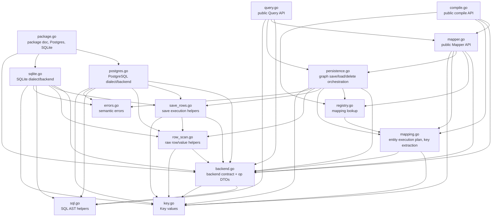

# ormapper — File Dependency Analysis

This report tracks the intended source-file layering after the persistence
semantic refactor. The important check is that backend contracts no longer point
at concrete database engines.

## Layered View

## Boundary Checks

| Check | Status | Notes |
|---|---|---|
| `backend.go` does not depend on `postgres.go` or `sqlite.go` | OK | `backend.go` owns only contracts. |
| Built-in dialect exposure is centralized | OK | `package.go` exposes `Postgres` and `SQLite`. |
| Concrete backend construction lives with each engine | OK | `postgresDialect.newBackend` is in `postgres.go`; `sqliteDialect.newBackend` is in `sqlite.go`. |
| `Mapper` does not perform graph persistence itself | OK | `mapper.go` validates public API inputs and delegates to `persistence.go`. |
| `persistence.go` no longer depends on `Mapper` | OK | It receives `mappingRegistry` and `backend`. |
| `save_graph.go` cross-reference is gone | OK | Relation reconcile code is inline in `persistence.go`. |
| `extract.go` standalone file is gone | OK | Key extraction is part of `mapping.go`, adjacent to mapping metadata. |
| `mapping.go` no longer depends on persistence helpers | OK | `uniqueFieldNames` moved into mapping code. |
| Backend operation DTOs do not carry entity field or relation plans | OK | Entity-facing `saveLayout` lives in `mapping.go`; relation diff helpers live in `persistence.go`. |
| `backend.go` contains contracts, not execution helpers | OK | Save execution and row scan helpers live outside `backend.go`. |
| Dialects do not recompute planned row keys | OK | `plannedRow` carries the planner-computed key used for returned-row correlation. |
| Persistence owns save semantic count checks | OK | Insert/update returned-row count checks live in `persistence.go`, not concrete dialects. |

## Current File Roles

| File | Layer | Role |
|---|---|---|
| `package.go` | Entry point | Package documentation and built-in dialect entry points. |
| `backend.go` | Driver contract / basic types | Public DB handle abstraction, internal backend contract, and backend operation DTOs. |
| `key.go` | Driver contract / basic types | Comparable key representation. |
| `errors.go` | Driver contract / basic types | Public semantic error sentinels. |
| `sql.go` | Driver contract / basic types | Query SQL node model and parser shared by query and dialect renderers. |
| `save_rows.go` | Backend support helper | Save execution helpers: split planned rows, project insert values, correlate returned rows by key. |
| `row_scan.go` | Backend support helper | Empty rows, raw row scan, normalization, and DB value coercion helpers. |
| `compile.go` | Mapping | Public mapping registration, struct tag analysis, validation, and private mapping construction subroutines. |
| `mapping.go` | Mapping | Compiled entity execution plans, save layout, child metadata, key extraction, and reflect accessors. |
| `registry.go` | Mapping | Mapping lookup abstraction shared by Mapper and persistence. |
| `mapper.go` | Mapper / persistence | Public aggregate API: `Get`, `Save`, `Delete`. |
| `query.go` | Mapper / persistence | Public typed query API. |
| `persistence.go` | Mapper / persistence | Stateless graph persistence orchestration. |
| `postgres.go` | Driver implementation | PostgreSQL SQL rendering and backend execution. |
| `sqlite.go` | Driver implementation | SQLite SQL rendering and backend execution. |

## Removed Files

- `dialect.go`: split into `package.go` and `backend.go`; concrete dialect
  methods moved to engine files.
- `doc.go`: package documentation moved to `package.go`.
- `build.go`: compile subroutines moved under `compile.go`.
- `analyze.go`: struct tag analysis moved under `compile.go`.
- `persistence_op.go`: renamed and merged into `persistence.go`.
- `save_graph.go`: merged into `persistence.go`.
- `extract.go`: merged into `mapping.go`.
- `operations.go`: backend operation DTOs moved into `backend.go`; save execution helpers moved into `save_rows.go` and raw scan helpers into `row_scan.go`.
- `row_projection.go`: replaced by `save_rows.go` after planner-owned keys made the helper responsibility narrower.

## Remaining Tensions

- `mapping.go` owns the entity-facing `saveLayout`, while `backend.go` owns the
  backend-facing `saveRowsLayout`. This split keeps entity field plans out of
  backend operation DTOs.
- `postgres.go` and `sqlite.go` are intentionally large because each keeps SQL
  rendering and execution together. Splitting renderers later should be based on
  evidence from readability or test friction, not file length alone.
